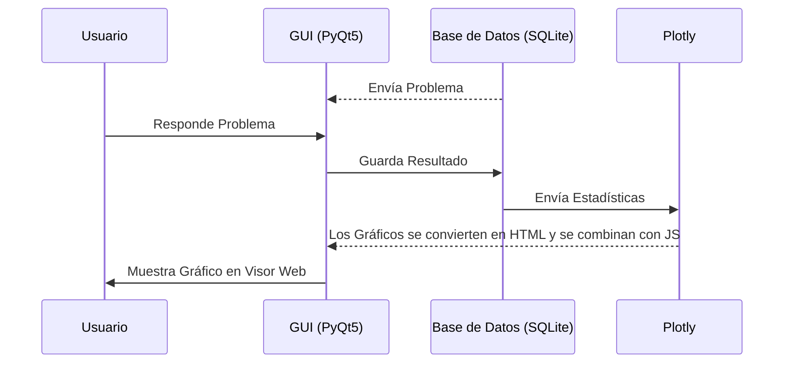

<div align="center">
    
</div>

<br>

<p align="center">
    
    
    
</p>

<p align="center">
    <strong>GENERADOR DE PROBLEMAS DE LA OLIMPIADA MATEMÁTICA ESPAÑOLA DE 2ºESO IMPULSADO POR IA</strong><br>
    <strong>DEMOCRATIZANDO LA EDUCACIÓN EN PEQUEÑAS REGIONES</strong>
</p>

<p align="center">
    <a href="README.md"><strong>ESPAÑOL</strong></a> | <a href="assets/documents/README.en.md"><strong>ENGLISH</strong></a>
</p>

> ⚠️ **Aclaración:** Actualmente el proyecto se encuentra en fase de desarrollo, por lo que la IA aún no ha sido entrenada. Además, todas las imágenes actuales (logo, fondos de las páginas...) han sido generadas usando IA (Gemini, Chat GPT...) y retocadas usando GIMP (eliminando la marca de agua por motivos estéticos), pero serán sustituidas por imágenes similares hechas a mano (sean mías o por un artista) antes de lanzar la versión oficial con IA entrenada.

## 🎯 El Problema: Desigualdad en la Excelencia. Esfuerzo & Talento contra Geografía

En la **Olimpiada Matemática Española**, el éxito no solo depende del talento y esfuerzo del alumno, sino de los recursos a su alcance. En comunidades autónomas grandes, es común que los estudiantes ganadores de la fase regional reciben entrenamiento especial por profesores de matemáticas, quienes les asisten con lecciones y problemas específicos para la fase nacional.

Sin embargo, en regiones como **Melilla**, esta infraestructura es prácticamente inexistente, lo que deja a los alumnos en una clara desventaja a la hora de ganar el campeonato a nivel nacional.


## 💡 La Solución: EPSILON OME TRAINER

**EPSILON OME TRAINER** es una herramienta diseñada para democratizar el entrenamiento de alto rendimiento. Mi objetivo es que cualquier estudiante de **2ºESO (más cursos en el futuro)**, sin importar si vive en el centro de una gran ciudad o en Melilla, tenga acceso a un preparador personal de matemáticas que le aporte una fuente ilimitada, confiable y gratuita de problemas olímpicos y feedback personalizado de su rendimiento.

Utilizando modelos avanzados de **Inteligencia Artificial**, la aplicación generará (una vez entrenada la IA) problemas de estilo olímpico de distinta dificultad (Provincial, Regional y Nacional) y temática (Aritmética & Teoría de Números, Álgebra, Geometría, Combinatoria & Probabilidad y Lógica & Razonamiento), rompiendo la barrera de la falta de profesorado especializado.

# 📼 DEMO

Esta demostración solo está disponible en inglés para que sea internacional, pero los elementos visuales están en español, por lo que un hispanohablante puede comprender todo sin problemas.

<br>
<div align="center">
    <a href="https://drive.google.com/file/d/1h3v9VlnXVyhw6PH22DZpPhXS1uGP12VO/view?usp=sharing">
        
    </a>
    
</div>
<br>

## ✨ Características Principales

**EPSILON OME TRAINER** no es solo una fuente de ejercicios, es un ecosistema de trabajo con feedback personalizado para simular un entrenamiento intensivo para la Olimpiada Matemática Española.

* **GENERACIÓN DE PROBLEMAS CON IA:** (En desarrollo) Utiliza un modelo de lenguaje modificado (Low Rank Adaptation) para crear enunciados originales que imitan el estilo de la Olimpiada Matemática Española de 2ºESO (más cursos en el futuro).
* **NIVELES DE DIFICULTAD PERSONALIZADOS:**
  * **Nivel Provincial:** Para asentar **conocimientos básicos** y familiarizarse con la abstracción de ls problemas olímpicos.
  * **Nivel Regional:** Desafíos de nivel intermedio que sirven como **puente entre el nivel provincial y el nacional**.
  * **Nivel Nacional:** Suficiente para ganar la competición a nivel regional y excelente base para la nacional. Sin embargo, una IA no puede abordar todos los contextos y trucos creativos (ideas felices) clásicos de esta competición, por lo que es necesario practicar con problemas de ediciones anteriores para verdaderamente tener una gran probabilidad de ganar la competición. Aún así, este nivel es útil para acortar la gran brecha existente entre el nivel regional y nacional.
* **📐 ÁREAS TEMÁTICAS CUBIERTAS:**
    * Aritmética y Teoría de Números.
    * Álgebra.
    * Geometría.
    * Combinatoria y Probabilidad.
    * Lógica y Razonamiento Abstracto.
* **🖥️ INTERFAZ INTUITIVA:** Desarrollada con **PyQt5**, ofreciendo una experiencia de escritorio fluida, rápida y enfocada en el estudio sin distracciones.
* **📜 FEEDBACK DETALLADO:**  Explicaciones paso a paso de los problemas para que el error sea la base del aprendizaje. Además, **EPSILON OME TRAINER** recoge datos sobre el número de aciertos y errores del usuario agrupados por curso, dificultad y temática y los muestra en gráficos de **Plotly** usando un **visor basado en QWebEngine**, permitiendo una rápida identificación de áreas fuertes y débiles.


## 🛠️ Instalación

### 📦 Usuario Final
> ⚠️ **Nota:** Actualmente el proyecto se encuentra en fase de desarrollo. El instalador oficial (para Windows, Mac y Ubuntu) estará disponible próximamente en la sección de [Releases](https://github.com/Crislopsaa/epsilon_ome_trainer/releases). Ahora mismo la IA no está entrenada, por lo que se lanzará pronto una demo sin IA. En el futuro, se entrenará la IA y se creará su correspondiente instalador.

### 💻 Desarrolladores (Ejecución desde código fuente)
Si deseas colaborar (de momento no hay ningún colaborador en el proyecto, lo estoy desarrollando independientemente) o probar las últimas funcionalidades antes del lanzamiento del instalador, sigue estos pasos:

#### 📋 Requisitos Previos

Antes de proceder con la instalación, asegúrate de tener instalado lo siguiente en tu sistema:

1. **Python 3.12.10:** El lenguaje base del proyecto.
2. **Git:** Para clonar y gestionar las versiones del repositorio.
3. **Motor LaTeX (MikTeX o TeX Live):** Necesario para que la aplicación pueda generar los PDFs de los problemas. Asegúrate de que `pdflatex` esté en el PATH de tu sistema.
4. **Compilador C++ (Windows):** Si instalas PyQt5 desde las fuentes, podrías necesitar las [Visual Studio Build Tools](https://visualstudio.microsoft.com/visual-cpp-build-tools/). 
   * *Nota: Normalmente, al instalar vía `pip`, se descargan los 'wheels' pre-compilados y esto no es estrictamente necesario, pero es bueno tenerlo como referencia si falla la instalación de PyQt5.*
5. **VS Code (Opcional):** El editor recomendado para trabajar en este proyecto.

### Instalación

1. **Clonar el repositorio:**
   ```bash
   # Puedes usar Git Bash, CMD o PowerShell
   git clone https://github.com/Crislopsaa/epsilon_ome_trainer.git
   cd epsilon-ome-trainer
   ```

2. **Configurar Entorno Virtual (no obligatorio, pero muy recomendable)**
    ```bash
    # Es necesario estar dentro de la carpeta del proyecto
    python -m venv venv
    # Activar en Windows (PowerShell/CMD):
    .\venv\Scripts\activate
    # Activar en Linux/macOS (Bash/Zsh):
    source venv/bin/activate
    ```

3. **Instalar dependencias**
   ```bash
   # Es necesario estar dentro de la carpeta del proyecto
   pip install -r requirements.txt
   ```

4. **Ejecutar la aplicación (importante estar en el directorio principal)**
   ```bash
   # Asegúrate de que "epsilon.py" esté en tu directorio actual
   python epsilon.py
   ```

## 🏗️ Arquitectura Técnica

**EPSILON OME TRAINER** sigue una programación modular y basada en eventos de PyQt5, intentando mantener los principios SOLID cuando sea posible. Esto garantiza una experiencia fluida, separando la UI (interfaz) de las interacciones con la base de datos y con la IA.

### 1. El Núcleo de la IA (aún a entrenar)
El "corazón" del proyecto es un modelo de lenguaje (LLM) modificado mediante **LoRA (Low-Rank Adaptation)**.
* **Optimización Específica:** LoRA permite el uso de una cantidad mucho menor de datos de entrenamiento y de hardware, ya que no se entrena un LLM desde cero ni se le enseñan matemáticas, sino que se le cambia su expresión (estilo olímpico).
* **Pipeline de Generación:** El sistema envía un *prompt* estructurado según el curso (solo 2ºESO de momento), el área temática y el nivel de dificultad (también está disponible un **modo automático**, que simplemente elige la combinación de curso-temática-dificultad que tenga menos problemas guardados en la base de datos local) $\rightarrow$ La IA genera un *string* que contiene los siguientes elementos separados por "\n###\n": Enunciado, Enunciado + Solución (por pasos) y Respuesta Final.
* **Uso de Código LaTeX:** Tanto el Enunciado como el Enunciado+Solución son códigos LaTeX que son convertidos en PDFs y mostrados al usuario (al presentar el problema y al mostrar su solución, respectivamente). La Respuesta Final se usa para determinar (usando la librería SymPy y convirtiendo tanto la Respuesta Final como la respuesta del usario en objetos SymPy) si la respuesta que da el usuario al problema (el resultado final numérico, algebraico...) es correcta o no.

### 2. Interfaz y Experiencia de Usuario (PyQt5)

La interfaz utiliza:
* **Visualización Avanzada:** Usa **QWebEngine** para renderizar un entorno web local (**motor Chromium**) dentro de la app de escritorio. Esto se utiliza para lo siguiente:
  * **PDFs:** Como se ha explicado antes, el Enunciados y el Enunciado+Solución, codificados en LaTeX, se convierten en PDFs. La app los muestra con un **visor basado en QWebEngine**.
  * **Interactividad:** Los gráficos Plotly son convertidos en HTML y conbinados con su respectivo JavaScript para que puedan ser mostrados con QWebEngine, evitando conflictos con las políticas de QWebEngine y la conexión con el "CDN" de Plotly sin perder la interactividad.
* **Uso de Eventos de PyQt5:** Mediante eventos de PyQt5, cuando las estadísticas del usuario cambian, su respectiva página es eliminada para mantener actualizado el feedback que aporta. Asimismo, para reducir el uso de memoria, se elimina la página de problemas al salir de ella, por lo que la única forma de mantener el problema es descargarlo en PDF tras resolverlo.
  
### 3. Flujo de Datos y Seguimiento de Progreso
El sistema de seguimiento transforma los aciertos y fallos del usuario en información de gran valor para el estudio:




## 🚀 Roadmap: El futuro de EPSILON OME TRAINER

El proyecto se encuentra en una fase inicial de crecimiento. Estos son los hitos planeados para el futuro:

- [CASI FINALIZADO] **Finalización de una GUI básica (Producto Mínimo Viable):** Lanzamiento de la Demo, versión funcional con problemas ejemplo antes de la integración total de la IA. Al finalizar este período, se publicarán los primeros instaladores (Windows, Mac y Ubuntu) para esta misma.
- [  ] **Entrenamiento del Modelo usando LoRA:** Recopilación de un dataset robusto de problemas de la Olimpiada Matemática de 1 y 2º ESO (modificados para evitar CopyRight) para el ajuste fino de la IA. Una vez hecho eso, se entrenará usando Google Colab para disminuir costes.
- [  ] **Lanzamiento de Primera Versión Funcional Oficial:** Usaré mis contactos con profesores y excompetidores de la Olimpiada para distribuir la aplicación, lo que puede incluir la creación de una página web para facilitar la distribución. 
- [  ] **Período de Mejora:** Estudio del impacto del proyecto y realización progresiva de mejoras. Estas son algunas de las posibles:
  - [  ] **Mejora de la Transición entre la página de inicio y la página de información y la de estadísticas:** Añadiré más funcionalidades para mejorar el feedback que el usuario recibe (página de estadísticas) y puede que incluso permitir la modificación de la IA al gusto del usario (página de información).
  - [  ] **Modo Simulación:** Temporizadores y estructura de examen real para practicar bajo presión.
  - [  ] **Soporte Multi-Curso:** Expansión del generador para cubrir **3º y 4º de ESO**.


## 🤝 Contribución

¡Cualquier ayuda es bienvenida! Si eres profesor de matemáticas, entusiasta de las olimpiadas o desarrollador de Python:

1. **Reporta errores:** Abre un *Issue* si encuentras algún fallo en la interfaz o en los cálculos.
2. **Sugiere funciones:** ¿Crees que falta alguna temática o curso? ¡Cuéntamelo!
3. **Difusión (una vez la aplicación sea completamente funcional):** Si conoces a alumnos en Melilla u otras regiones que puedan beneficiarse, comparte el proyecto.


## 📜 Licencia y Agradecimientos

Este proyecto se distribuye bajo la licencia **GNU General Public License v3.0**. Consulta el archivo `LICENSE` para más detalles.

### 📚 Créditos de Software y Librerías
**EPSILON OME TRAINER** no sería posible sin las siguientes tecnologías:

* **Core:** [Python 3.12.10](https://www.python.org/) y el motor de tipos dinámicos [SymPy](https://www.sympy.org/).
* **Interfaz:** [PyQt5](https://www.riverbankcomputing.com/software/pyqt/) y [PyQtWebEngine](https://www.riverbankcomputing.com/software/pyqtwebengine/).
* **Motor de Inteligencia Artificial:** [llama-cpp-python](https://github.com/abetlen/llama-cpp-python) — Inferencia local de LLMs optimizada para CPU/GPU.
* **Visualización:** [Plotly](https://plotly.com/python/), [Pandas](https://pandas.pydata.org/) y [NumPy](https://numpy.org/).
* **Documentación:** [LaTeX (pdflatex)](https://www.latex-project.org/) para la generación profesional de problemas en PDF.

### 🛠️ Herramientas de Desarrollo
Mi agradecimiento a las plataformas que facilitan la creación de software libre:
* **GitHub:** Por el alojamiento del código y las herramientas de integración.
* **VS Code:** El editor principal de este proyecto.
* **GIMP:** Utilizado para el retoque estético de los recursos visuales.
* **Microsoft Visual Studio Build Tools:** Por los compiladores de C++ necesarios para el entorno de desarrollo en Windows.

> ### 📝 Nota sobre el Historial del Repositorio
> Este repositorio es una versión refinada y organizada del proyecto original. Los commits iniciales incluían muchos cambios por commit, pero en este repositorio se han dividido de forma atómica (Atomic Commits) para garantizar un historial de cambios limpio, profesional y fácil de seguir, migrando el trabajo previo desde un entorno de desarrollo local. Es por eso que en los primeros commits hay diferencias de tiempo tan pequeñas.

---
<p align="center">CREADO POR <strong>CRISTIAN LÓPEZ SAAVEDRA</strong> - DEMOCRATIZANDO LA EDUCACIÓN EN PEQUEÑAS REGIONES</p>