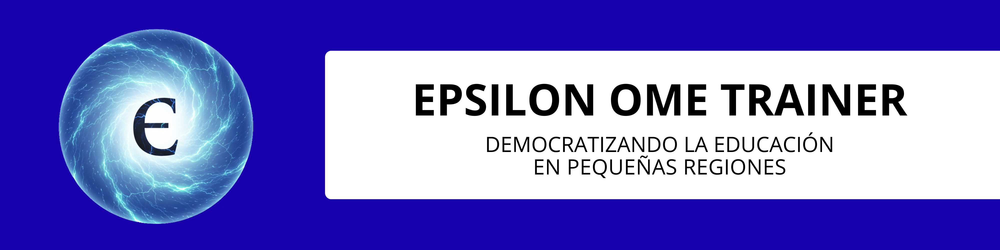
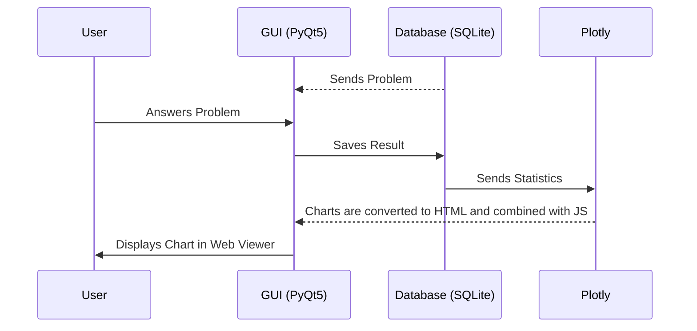

<div align="center">
    
</div>

<br>

<p align="center">
    
    
    
</p>

<p align="center">
    <strong>AI-POWERED PROBLEM GENERATOR FOR 2nd ESO (8th GRADE) SPANISH MATHEMATICAL OLYMPIAD</strong><br>
    <strong>DEMOCRATIZING EDUCATION IN SMALL REGIONS</strong>
</p>

<p align="center">
    <a href="../../README.md"><strong>ESPAÑOL</strong></a> | <a href="./README.en.md"><strong>ENGLISH</strong></a>
</p>

> ⚠️ **Clarification:** The project is currently in the development phase, so the AI has not yet been trained. Additionally, all current images (logo, page backgrounds...) have been generated using AI (Gemini, ChatGPT...) and retouched using GIMP (removing watermarks for aesthetic reasons), but they will be replaced by similar handmade images (either my own or by an artist) before launching the official version with trained AI.

## 🎯 The Problem: Inequality in Excellence. Effort & Talent vs. Geography

In the **Spanish Mathematical Olympiad**, success depends not only on the student's talent and effort but also on the resources at their disposal. In large autonomous communities, it is common for students who win the regional phase to receive special training from mathematics professors, who assist them with specific lessons and problems for the national phase.

However, in regions like **Melilla**, this infrastructure is practically non-existent, leaving students at a clear disadvantage when it comes to winning the national championship.


## 💡 The Solution: EPSILON OME TRAINER

**EPSILON OME TRAINER** is a tool designed to democratize high-performance training. My goal is for any student in **2nd ESO (more grades in the future)**, regardless of whether they live in the center of a large city or in Melilla, to have access to a personal math coach providing an unlimited, reliable, and free source of Olympiad problems and personalized performance feedback.

Utilizing advanced **Artificial Intelligence** models, the application will generate (once the AI is trained) Olympiad-style problems of varying difficulty (Provincial, Regional, and National) and topics (Arithmetic & Number Theory, Algebra, Geometry, Combinatorics & Probability, and Logic & Reasoning), breaking the barrier of the lack of specialized teachers.

# 📼 DEMO

The visual elements are in Spanish, but the audio is in English for English speakers to understand everything without issues.

<br>
<div align="center">
    <a href="https://drive.google.com/file/d/1h3v9VlnXVyhw6PH22DZpPhXS1uGP12VO/view?usp=sharing">
        
    </a>
    
</div>
<br>

## ✨ Main Features

**EPSILON OME TRAINER** is not just a source of exercises; it is a work ecosystem with personalized feedback designed to simulate intensive training for the Spanish Mathematical Olympiad.

* **AI PROBLEM GENERATION:** (In development) Uses a modified language model (Low-Rank Adaptation) to create original statements that mimic the style of the 2nd ESO Spanish Mathematical Olympiad (more grades in the future).
* **CUSTOM DIFFICULTY LEVELS:**
  * **Provincial Level:** To solidify **basic knowledge** and become familiar with the abstraction of Olympiad problems.
  * **Regional Level:** Intermediate challenges that serve as a **bridge between the provincial and national levels**.
  * **National Level:** Sufficient to win the regional competition and an excellent foundation for the national one. However, an AI cannot address all contexts and creative tricks ("Aha! moments") classic to this competition, so it is necessary to practice with problems from previous editions to truly have a high probability of winning. Still, this level is useful for closing the large gap between regional and national levels.
  
* **📐 COVERED TOPICS:**
    * Arithmetic and Number Theory.
    * Algebra.
    * Geometry.
    * Combinatorics and Probability.
    * Logic and Abstract Reasoning.
* **🖥️ INTUITIVE INTERFACE:** Developed with **PyQt5**, offering a smooth, fast desktop experience focused on distraction-free study.
* **📜 DETAILED FEEDBACK:** Step-by-step explanations of problems so that errors become the basis for learning. Additionally, **EPSILON OME TRAINER** collects data on the user's successes and failures grouped by grade, difficulty, and topic, displaying them in **Plotly** graphs using a **QWebEngine-based viewer**, allowing for quick identification of strengths and weaknesses.


## 🛠️ Installation

### 📦 End User
> ⚠️ **Note:** The project is currently in the development phase. The official installer (for Windows, Mac, and Ubuntu) will be available soon in the [Releases](https://github.com/Crislopsaa/epsilon_ome_trainer/releases) section. Currently, the AI is not trained, so a demo without AI will be launched shortly. In the future, the AI will be trained and its corresponding installer will be created.

### 💻 Developers (Running from Source Code)
If you wish to collaborate (currently there are no collaborators; I am developing it independently) or test the latest features before the installer launch, follow these steps:

#### 📋 Prerequisites

Before proceeding with the installation, ensure you have the following installed on your system:

1. **Python 3.12.10:** The base language of the project.
2. **Git:** For cloning and managing repository versions.
3. **LaTeX Engine (MikTeX or TeX Live):** Necessary for the application to generate problem PDFs. Ensure `pdflatex` is in your system's PATH.
4. **C++ Compiler (Windows):** If you install PyQt5 from source, you might need the [Visual Studio Build Tools](https://visualstudio.microsoft.com/visual-cpp-build-tools/). 
   * *Note: Normally, when installing via `pip`, pre-compiled "wheels" are downloaded and this is not strictly necessary, but it is good to have as a reference if the PyQt5 installation fails.*
5. **VS Code (Optional):** The recommended editor for working on this project.

### Installation

1. **Clone the repository:**
   ```bash
   # You can use Git Bash, CMD, or PowerShell
   git clone https://github.com/Crislopsaa/epsilon_ome_trainer.git
   cd epsilon-ome-trainer
   ```

2. **Configure Virtual Environment (not mandatory, but highly recommended)**
   ```bash
    # You must be inside the project folder
    python -m venv venv
    # Activate on Windows (PowerShell/CMD):
    .\venv\Scripts\activate
    # Activate on Linux/macOS (Bash/Zsh):
    source venv/bin/activate
   ```

3. **Install dependencies**
    ```bash
    # You must be inside the project folder
    pip install -r requirements.txt
    ```

4. **Run the application (important to be in the main directory)**
    ```bash
    # Ensure "epsilon.py" is in your current directory
    python epsilon.py
    ```


## 🏗️ Technical Architecture

**EPSILON OME TRAINER** follows a modular and event-driven programming approach using PyQt5, striving to maintain SOLID principles whenever possible. This ensures a fluid experience by separating the UI (interface) from database interactions and AI processes.

### 1. The AI Core (Training Pending)
The "heart" of the project is a Large Language Model (LLM) modified via **LoRA (Low-Rank Adaptation)**.
* **Specific Optimization:** LoRA allows for the use of a much smaller amount of training data and hardware, as it does not involve training an LLM from scratch or teaching it mathematics; instead, it refines its expression (Olympiad style).
* **Generation Pipeline:** The system sends a structured *prompt* based on the grade level (currently only 2nd ESO), subject area, and difficulty level (an **automatic mode** is also available, which simply selects the combination of grade-subject-difficulty with the fewest problems stored in the local database) $\rightarrow$ The AI generates a *string* containing the following elements separated by "\n###\n": Problem Formulation, Formulation + Solution (step-by-step), and Final Answer.
* **Use of LaTeX Code:** Both the Formulation and the Formulation + Solution are LaTeX codes converted into PDFs and displayed to the user (when presenting the problem and showing its solution, respectively). The Final Answer is used to determine (using the SymPy library and converting both the Final Answer and the user's input into SymPy objects) whether the user's response to the problem (the final numerical or algebraic result...) is correct or not.

### 2. Interface and User Experience (PyQt5)

The interface utilizes:
* **Advanced Visualization:** It uses **QWebEngine** to render a local web environment (**Chromium engine**) within the desktop app. This is used for the following:
  * **PDFs:** As explained above, the Formulation and Formulation + Solution, encoded in LaTeX, are converted into PDFs. The app displays them using a **QWebEngine-based viewer**.
  * **Interactivity:** Plotly charts are converted to HTML and combined with their respective JavaScript so they can be displayed with QWebEngine, avoiding conflicts with QWebEngine policies and the Plotly "CDN" connection without losing interactivity.
* **Use of PyQt5 Events:** Through PyQt5 events, when user statistics change, the respective page is deleted to keep the feedback updated. Likewise, to reduce memory usage, the problem page is removed upon exit; therefore, the only way to keep the problem is to download it as a PDF after solving it.

### 3. Data Flow and Progress Tracking
The tracking system transforms user successes and failures into high-value information for study:




## 🚀 Roadmap: The Future of EPSILON OME TRAINER

The project is currently in an initial growth phase. These are the planned milestones for the future:

- [NEARLY FINISHED] **Completion of a basic GUI (Minimum Viable Product):** Launch of the Demo, a functional version with sample problems prior to full AI integration. Upon completion of this period, the first installers (Windows, Mac, and Ubuntu) will be released.
-  [  ] **Model Training using LoRA:** Collection of a robust dataset of Mathematical Olympiad problems for 1st and 2nd ESO (modified to avoid Copyright) for AI fine-tuning. Once completed, training will be conducted using Google Colab to minimize costs.
- [  ] **Launch of the First Official Functional Version:** I will leverage my contacts with teachers and former Olympiad competitors to distribute the application, which may include the creation of a website to facilitate distribution.
-  [  ] **Improvement Period:** Impact study of the project and progressive implementation of enhancements. Some potential improvements include:
   -  [  ] **Transition Enhancements:** Improving the flow between the home page, information page, and statistics page. I will add more features to enhance user feedback (user stats page) and potentially allow AI customization according to user preferences (info page).
   -  [  ] **Simulation Mode:** Timers and real exam structures to practice under pressure.
   -  [  ] **Multi-Grade Support:** Expansion of the generator to cover **3rd and 4th of ESO**.


## 🤝 Contribution

Any help is welcome! If you are a mathematics teacher, an Olympiad enthusiast, or a Python developer:

1. **Report bugs:** Open an *Issue* if you find any errors in the interface or calculations.
2. **Suggest features:** Do you think a specific topic or grade level is missing? Let me know!
3. **Spread the word (once the application is fully functional):** If you know students in Melilla or other regions who could benefit, please share the project.


## 📜 License and Acknowledgments

This project is distributed under the **GNU General Public License v3.0**. Consult the `LICENSE` file for more details.

### 📚 Software and Library Credits
**EPSILON OME TRAINER** would not be possible without the following technologies:

* **Core:** [Python 3.12.10](https://www.python.org/) and the symbolic mathematics engine [SymPy](https://www.sympy.org/).
* **Interface:** [PyQt5](https://www.riverbankcomputing.com/software/pyqt/) and [PyQtWebEngine](https://www.riverbankcomputing.com/software/pyqtwebengine/).
* **AI Engine:** [llama-cpp-python](https://github.com/abetlen/llama-cpp-python) — Local LLM inference optimized for CPU/GPU.
* **Visualization:** [Plotly](https://plotly.com/python/), [Pandas](https://pandas.pydata.org/), and [NumPy](https://numpy.org/).
* **Documentation:** [LaTeX (pdflatex)](https://www.latex-project.org/) for professional PDF problem generation.

### 🛠️ Development Tools
My thanks to the platforms that facilitate the creation of open-source software:
* **GitHub:** For code hosting and integration tools.
* **VS Code:** The primary editor for this project.
* **GIMP:** Used for the aesthetic refinement of visual assets.
* **Microsoft Visual Studio Build Tools:** For the C++ compilers required for the Windows development environment.

> ### 📝 Note on Repository History
> This repository is a refined and organized version of the original project. Initial commits were originally bulkier, but, in this repository, they have been restructured into Atomic Commits to ensure a clean, professional, and easy-to-follow change history, migrating previous work from a local development environment. This is why the early commits show such small time differences.

---
<p align="center">CREATED BY <strong>CRISTIAN LÓPEZ SAAVEDRA</strong> - DEMOCRATIZING EDUCATION IN SMALL REGIONS</p>